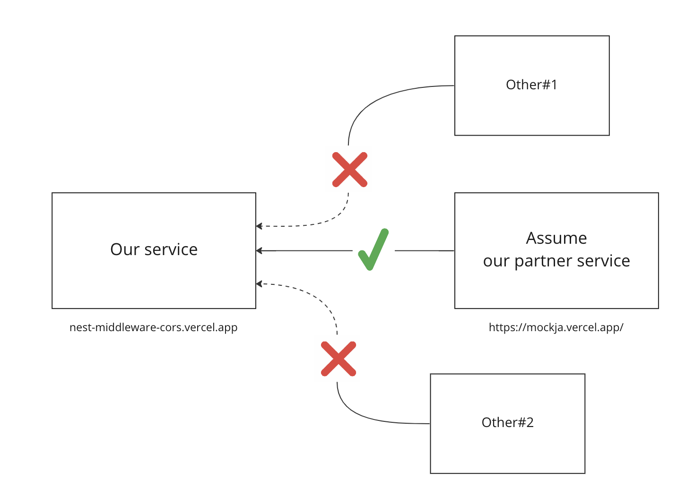
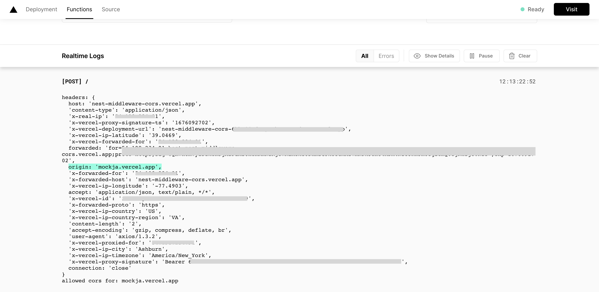
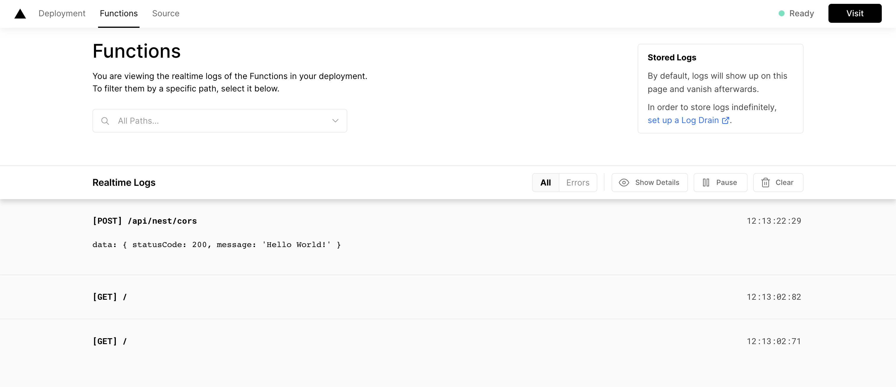
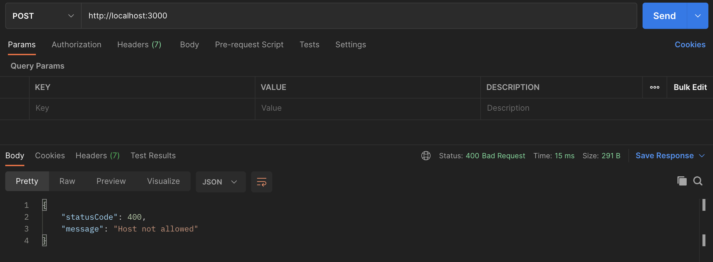

# Nest middleware with CORS

> AppModule based on `NestFastifyApplication`.



I would like to receive request from partner service only. How to block other services... :

Assume:

- Our service is `nest-middleware-cors.vercel.app`.
- Partner service is `mockja.vercel.app`.

Directory structure :

```sh
.
├── README.md
├── nest-cli.json
├── package.json
├── src
│   ├── app.controller.spec.ts
│   ├── app.controller.ts
│   ├── app.module.ts
│   ├── app.service.ts
│   ├── constants
│   │   └── allowed-origin.ts
│   ├── cors.middleware.ts
│   └── main.ts
├── test
│   ├── app.e2e-spec.ts
│   └── jest-e2e.json
├── tsconfig.build.json
└── tsconfig.json
```

## Create CORS middleware

Create `cors.middleware.ts` then :

- use `use(req, res, next)` of `expressjs`.
- prepare whitelist in `./constants/allowed-origin`.
  - if `hostname` exists in whitelist, do next.
  - else return `Host not allowed`.

```ts
import {
  HttpException,
  HttpStatus,
  Injectable,
  NestMiddleware,
} from '@nestjs/common';
import { Request, Response } from 'express';
import { allowedOrigins } from './constants/allowed-origin';

@Injectable()
export class CorsMiddleware implements NestMiddleware {
  use(req: Request, res: Response, next: () => void) {
    const origin = req.headers.origin;
    const allowedHeaders = [
      'Access-Control-Allow-Origin',
      'Origin',
      'X-Requested-With',
      'Accept',
      'Content-Type',
      'Authorization',
    ]

    // Ensure that client sent origin to our service
    console.log('headers:', req.headers)

    if (allowedOrigins.indexOf(origin) > -1) {
      console.log('allowed cors for:', origin);
      res.setHeader('Access-Control-Allow-Origin', origin);
      res.setHeader('Access-Control-Allow-Methods', 'POST');
      res.setHeader('Access-Control-Allow-Headers', allowedHeaders.join(', '));
      next();
    } else {
      throw new HttpException('Host not allowed', HttpStatus.BAD_REQUEST);
    }
  }
}
```

## Consume middleware

In `app.module.ts` adding middleware consumer, by focusing on specific path `/*` with `POST` method :

```ts
import { MiddlewareConsumer, Module, RequestMethod } from '@nestjs/common';
import { AppController } from './app.controller';
import { AppService } from './app.service';
import { CorsMiddleware } from './cors.middleware';

@Module({
  imports: [],
  controllers: [AppController],
  providers: [AppService],
})
export class AppModule {
  configure(consumer: MiddlewareConsumer) {
    consumer
      .apply(CorsMiddleware)
      .forRoutes({ path: '/*', method: RequestMethod.POST });
  }
}
```

## Adding example API

In `app.controller.ts`, changing `@Get` to `@Post` :

```ts
import { Controller, HttpStatus, Post, Res } from '@nestjs/common';
import { AppService } from './app.service';

@Controller()
export class AppController {
  constructor(private readonly appService: AppService) {}

  @Post()
  async getHello(@Res() res) {
    return res.send({
      statusCode: HttpStatus.OK,
      message: this.appService.getHello()
    });
  }
}
```

example response :

```json
{
  "statusCode": 200,
  "message": "Hello World!"
}
```

## Usage

Install dependencies :

```sh
yarn
```

```sh
yarn install v1.22.19
info No lockfile found.
[1/4] 🔍  Resolving packages...
warning @nestjs/cli > @nestjs/schematics > @angular-devkit/schematics > magic-string > sourcemap-codec@1.4.8: Please use @jridgewell/sourcemap-codec instead
[2/4] 🚚  Fetching packages...
[3/4] 🔗  Linking dependencies...
warning " > ts-loader@9.4.2" has unmet peer dependency "webpack@^5.0.0".
[4/4] 🔨  Building fresh packages...
success Saved lockfile.
✨  Done in 21.67s.
```

Run dev env :

```sh
yarn start:dev
```

```
[HH:mm:ss PM] File change detected. Starting incremental compilation...

[HH:mm:ss PM] Found 0 errors. Watching for file changes.

[Nest] 11194  - MM/DD/YYYY, HH:mm:ss PM     LOG [NestFactory] Starting Nest application...
[Nest] 11194  - MM/DD/YYYY, HH:mm:ss PM     LOG [InstanceLoader] AppModule dependencies initialized +7ms
[Nest] 11194  - MM/DD/YYYY, HH:mm:ss PM     LOG [RoutesResolver] AppController {/}: +5ms
[Nest] 11194  - MM/DD/YYYY, HH:mm:ss PM     LOG [RouterExplorer] Mapped {/, POST} route +0ms
[Nest] 11194  - MM/DD/YYYY, HH:mm:ss PM     LOG [NestApplication] Nest application successfully started +1ms
```

## Testing

I have already deploy service to `Vercel` server. Let's try based on use case below.

This is example source code for `mockja.vercel.app` :

- Adding `Origin` to headers.
- `POST` to `nest-middleware-cors.vercel.app`.

```js
const express = require('express')
const axios = require('axios')
const router = express.Router()

router.post('/nest/cors', async (req, res) => {

    const response = await axios({
        method: 'post',
        url: process.env.TEST_NEST_CORS_URL,
        headers: {
            Origin: req.headers.host,
        },
        data: {}
    })
    .then((r) => ({ error: null, data: r.data }))
    .catch((e) => ({ error: e, data: null }))

    if(response.error) {
        console.log('error:', response.error.message)
        res
        .status(response.error.response.status)
        .json({ 
            statusCode: response.error.response.status, 
            message: response.error.message
        })
    } else {
        console.log('data:', response.data)
        res.status(response.data.statusCode).json(response.data)
    }
})

module.exports = router
```

In `./constants/allowed-origin.ts`, adding some server host name :

```ts
export const allowedOrigins = ['mockja.vercel.app'];
```

Start from calling API in `https://mockja.vercel.app` to trick it to POST to `nest-middleware-cors.vercel.app`.

In `nest-middleware-cors.vercel.app`, you will see origin :



In `mockja.vercel.app`, you will got the result :



In case you calling from `localhost`, you will be blocked :


