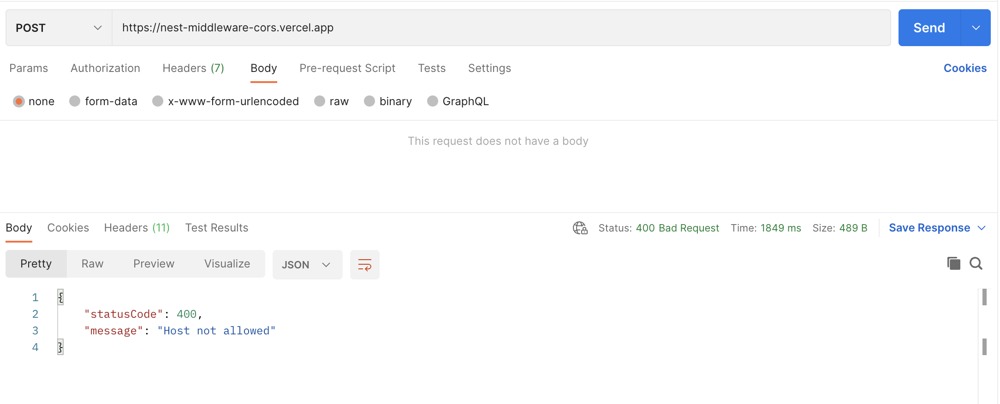

# Nest middleware with CORS

Directory structure :

```sh
.
├── README.md
├── nest-cli.json
├── package.json
├── src
│   ├── app.controller.spec.ts
│   ├── app.controller.ts
│   ├── app.module.ts
│   ├── app.service.ts
│   ├── constants
│   │   └── allowed-origin.ts
│   ├── cors.middleware.ts
│   └── main.ts
├── test
│   ├── app.e2e-spec.ts
│   └── jest-e2e.json
├── tsconfig.build.json
└── tsconfig.json
```

## Create CORS middleware

Create `cors.middleware.ts` then :

- use `use(req, res, next)` of `expressjs`.
- prepare whitelist in `./constants/allowed-origin`.
  - if `hostname` exists in whitelist, do next.
  - else return `Host not allowed`.

```ts
import {
  HttpException,
  HttpStatus,
  Injectable,
  NestMiddleware,
} from '@nestjs/common';
import { Request, Response } from 'express';
import { allowedOrigins } from './constants/allowed-origin';

@Injectable()
export class CorsMiddleware implements NestMiddleware {
  use(req: Request, res: Response, next: () => void) {
    const hostname = req.hostname;
    console.log('hostname:', hostname);
    if (allowedOrigins.indexOf(hostname) > -1) {
      console.log('allowed cors for:', hostname);
      res.setHeader('Access-Control-Allow-Origin', hostname);
      res.setHeader('Access-Control-Allow-Methods', 'POST');
      res.setHeader('Access-Control-Allow-Headers', 'Content-Type, Accept');
      next();
    } else {
      throw new HttpException('Host not allowed', HttpStatus.BAD_REQUEST);
    }
  }
}

```

## Consume middleware

In `app.module.ts` adding middleware consumer, by focusing on specific path `/*` with `POST` method :

```ts
import { MiddlewareConsumer, Module, RequestMethod } from '@nestjs/common';
import { AppController } from './app.controller';
import { AppService } from './app.service';
import { CorsMiddleware } from './cors.middleware';

@Module({
  imports: [],
  controllers: [AppController],
  providers: [AppService],
})
export class AppModule {
  configure(consumer: MiddlewareConsumer) {
    consumer
      .apply(CorsMiddleware)
      .forRoutes({ path: '/*', method: RequestMethod.POST });
  }
}
```

### Adding example API

In `app.controller.ts`, changing `@Get` to `@Post` :

```ts
import { Controller, Post } from '@nestjs/common';
import { AppService } from './app.service';

@Controller()
export class AppController {
  constructor(private readonly appService: AppService) {}

  @Post()
  getHello(): string {
    return this.appService.getHello();
  }
}
```

## Usage

Install dependencies :

```sh
yarn
```

```sh
yarn install v1.22.19
info No lockfile found.
[1/4] 🔍  Resolving packages...
warning @nestjs/cli > @nestjs/schematics > @angular-devkit/schematics > magic-string > sourcemap-codec@1.4.8: Please use @jridgewell/sourcemap-codec instead
[2/4] 🚚  Fetching packages...
[3/4] 🔗  Linking dependencies...
warning " > ts-loader@9.4.2" has unmet peer dependency "webpack@^5.0.0".
[4/4] 🔨  Building fresh packages...
success Saved lockfile.
✨  Done in 21.67s.
```

Run dev env :

```sh
yarn start:dev
```

```
[HH:mm:ss PM] File change detected. Starting incremental compilation...

[HH:mm:ss PM] Found 0 errors. Watching for file changes.

[Nest] 11194  - MM/DD/YYYY, HH:mm:ss PM     LOG [NestFactory] Starting Nest application...
[Nest] 11194  - MM/DD/YYYY, HH:mm:ss PM     LOG [InstanceLoader] AppModule dependencies initialized +7ms
[Nest] 11194  - MM/DD/YYYY, HH:mm:ss PM     LOG [RoutesResolver] AppController {/}: +5ms
[Nest] 11194  - MM/DD/YYYY, HH:mm:ss PM     LOG [RouterExplorer] Mapped {/, POST} route +0ms
[Nest] 11194  - MM/DD/YYYY, HH:mm:ss PM     LOG [NestApplication] Nest application successfully started +1ms
```

## Testing

In `./constants/allowed-origin.ts`, adding some server host name :

```ts
export const allowedOrigins = ['mockja.vercel.app'];
```



Let's try to adding `localhost` :

```ts
export const allowedOrigins = ['mockja.vercel.app', 'localhost'];
```


